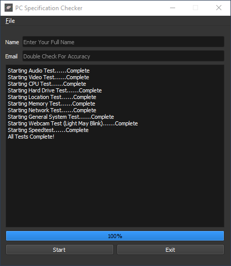

## SpecCheckWithGui --In Progress, Working Title--
SpecCheck is a PC specifications checker with the ability to post results to Google Sheets or email the results to an address listed in the configuration files. This will eventually be cross platform with a port to MacOS being priority.

## Motivation
Someone close to me offhandidly asked if it would be possible to easily write a program to test various system specs on both Windows and Macs and submit those values somewhere remotely. I figured it sounded easy enough, but some of the ideas started to grow out of control. 

For instance, it's rather easy to determine if a network connection is present, however it's proving rather difficult to determine if that connection is wired or wifi on multiple platforms. Another piece of requested information was the presence of system antivirus. As it turns out, not a lot of antivirus programs appreciate being asked questions.

In the end, I decided to make this an actual working project to learn and grow from. I also decided to add a GUI, my first. I plan on fully documenting everything, and hopefully others can get some good use.
 
## Screenshots

## Tech/framework used

<b>Built with:</b>
- [Python](https://www.python.org/)
- [PyQt5](https://riverbankcomputing.com/software/pyqt)
- [nose2](https://docs.nose2.io/en/latest/)
- [fman build system](https://build-system.fman.io/)
- [PyInstaller](https://www.pyinstaller.org/)

## Features

SpecChecker aims to test and report the following systems:
- CPU
- GPU
- Hard Drives
- Location Info As Reported By IP.INFO
- Memory
- Network
- Sound
- Speedtest
- General System Information
- Operating System Information Including Activation Status
- Internet Speed Test

The project also will allow posting to Google Sheets among other methods such as email. This is done through POST data to Google Forms rather than GET or using Sheets API. There aren't many people explaining how to do this, so I plan to do an in depth tutorial in a side project because it's very useful and way easier to implement based on personal requirements.

## Code Example
TODO. In the meantime, the easiest way to play with the code is copying the files in the python directory into your project and importing SpecRecord from spec_record.py. 

From there, you can run tests from SpecRecord.module_name.test() and access results from SpecRecord.module_name.property or SpecRecord.module_name[0].property for modules that return a list.

## Installation
TODO, Windows only kinda works. The requirement files are in requirements\windows.txt and will eventually be broken down by system per fbs requirements. Sadly, the requirements file isn't complete as my ide keeps changing the file. This will change after I regester my copy of fbs and can upgrade components like PyInstaller. Pip errors point out missing modules. Commonly wmi disapears as does pdoc3

## API Reference

A reference is coming and will be pdoc3 generated.

## Tests
All the tests are located in the python\tests folder. They are currently testing class return values and needs some expanding. 

## How to use?
When I get the first version released, it will be as simple as downloading the install file and running the program. A full guide will be written at that time.

## Credits
I have a bunch to put here. FBS, PyInstaller, GPUtil, PyWiFi, PyQt, so many. 

I will be including a list of tutorials I followed as well. I came across a LOT of excellent resources.

## License

MIT License © [Houdinii](https://github.com/houdinii)

Copyright (c) 2021 Brian Barnes Jr. AKA Houdinii

Permission is hereby granted, free of charge, to any person obtaining a copy
of this software and associated documentation files (the "Software"), to deal
in the Software without restriction, including without limitation the rights
to use, copy, modify, merge, publish, distribute, sublicense, and/or sell
copies of the Software, and to permit persons to whom the Software is
furnished to do so, subject to the following conditions:

The above copyright notice and this permission notice shall be included in all
copies or substantial portions of the Software.

THE SOFTWARE IS PROVIDED "AS IS", WITHOUT WARRANTY OF ANY KIND, EXPRESS OR
IMPLIED, INCLUDING BUT NOT LIMITED TO THE WARRANTIES OF MERCHANTABILITY,
FITNESS FOR A PARTICULAR PURPOSE AND NONINFRINGEMENT. IN NO EVENT SHALL THE
AUTHORS OR COPYRIGHT HOLDERS BE LIABLE FOR ANY CLAIM, DAMAGES OR OTHER
LIABILITY, WHETHER IN AN ACTION OF CONTRACT, TORT OR OTHERWISE, ARISING FROM,
OUT OF OR IN CONNECTION WITH THE SOFTWARE OR THE USE OR OTHER DEALINGS IN THE
SOFTWARE.